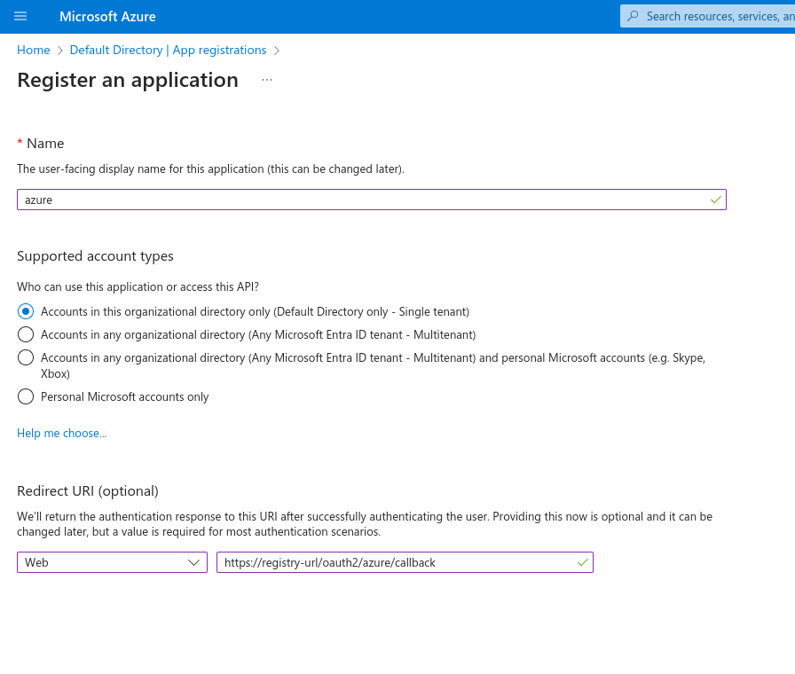
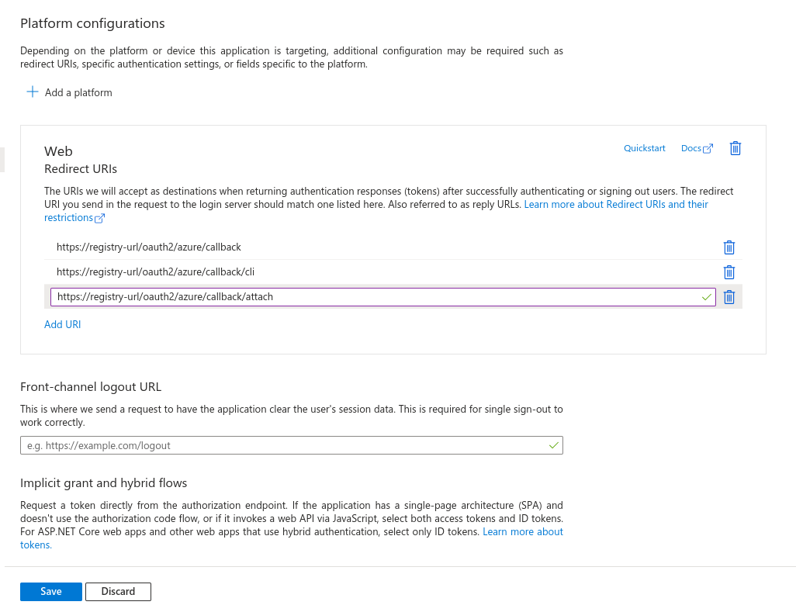
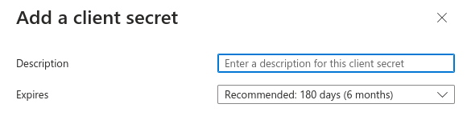
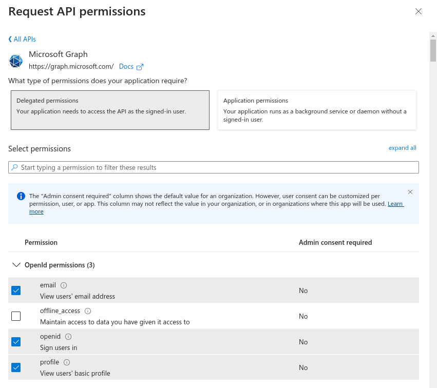
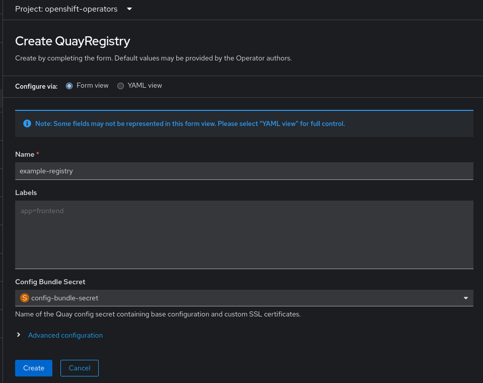

1. Login to azure account >> Azure Services >> Microsoft Entra ID >> App Registraion >> New Registraion. Enter a `name` and select `Accounts in this organization`. In redirect url select `web` from drop down menu and add `registry callback url` like below and then submit it.



2. Now go to Microsoft Entra ID >> App Registraion >> All Applications >> azure >> click on "Redirect URIs" >> Add Url to add new URL and add 2 new URLs as listed below. Once saved, Note down the **Application (client) ID**, we have to use it later in **config.yaml** with  **CLIENT_ID** parameter.



4. Click on `Cient Credentials` to create a new secret. On `Certificates & secrets` window click on `New client secret`. Add a name and expiry date. Once secret is created, note down the it's **Value**. We have to use it later in config.yaml with **CLIENT_SECRET** parameter.  



5.  Go to  Microsoft Entra ID >> App Registraion >> Click on app which you just created >> Manage >> API Permissions >> Add a Permission >> Microsoft Graph >> Delegated Permissions >> OpenId Permissions >> Select **email**, **openid**, **profile**
  
  
6. Create config.yaml with following output. In OIDC_SERVER, after sts.windows.net you have to provide the Entra ID `tenant ID`, which can be fetched by navigating to `Azure Services >> Microsoft Entra ID`
```bash
AZURE_LOGIN_CONFIG:
    CLIENT_ID: "**********************************"
    CLIENT_SECRET: "*************************************"
    OIDC_SERVER: https://sts.windows.net/*********************89798/
    SERVICE_NAME: "azure"
    VERIFIED_EMAIL_CLAIM_NAME: "email"
    IGNORE_VALIDATION: true
```


7. Create a secret with config.yaml file. Replace the `namespace` with the target namespace in which operator is installed and you are creating the registry.

```bash
oc create secret generic --from-file config.yaml=./config.yaml config-bundle-secret -n openshift-operators
```

8. Now create the registry and in registry configuration assign above secret.


